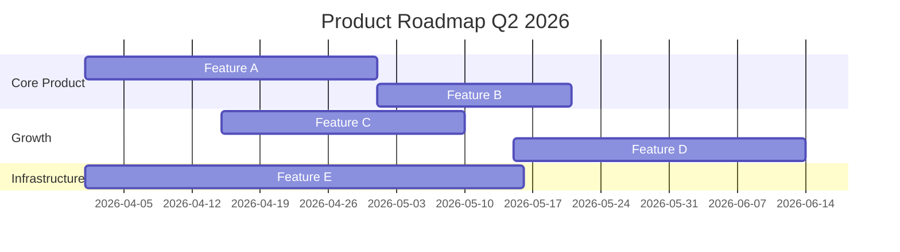

# /roadmap-builder - Product Roadmap Generator

## Triggers
- Quarterly planning sessions
- Investor/board updates requiring roadmap
- Aligning team on what's coming next

## Usage
```
/roadmap-builder
/roadmap-builder --format now-next-later
/roadmap-builder --format timeline
/roadmap-builder --quarter Q2-2026
```

## Behavioral Flow

### Phase 1: Input Collection
Gather roadmap inputs:
```
1. Strategic goals (from OKRs or company objectives)
2. Prioritized feature list (from feature-prioritizer)
3. Team capacity (people × weeks available)
4. Dependencies and constraints
5. Audience (internal team / investors / customers)
```

### Phase 2: Framework Selection

**Now-Next-Later (recommended for startups):**
```markdown
## Product Roadmap

### 🟢 NOW (This Month/Sprint)
Committed work, high confidence.
- [Feature] — [Owner] — [Status]

### 🟡 NEXT (Next 1-3 Months)
Planned work, medium confidence.
- [Feature] — [Why now]

### 🔴 LATER (3-6 Months)
Exploratory, low confidence. Subject to change.
- [Feature] — [Depends on]

### 🗑️ NOT DOING
Explicitly decided against.
- [Feature] — [Why not]
```

**Timeline (Gantt-style, for investors/board):**


### Phase 3: Generate Roadmap

```markdown
# Product Roadmap — [Period]

**Last Updated**: YYYY-MM-DD
**Owner**: [CPO/PM Name]
**Strategy**: [1-sentence strategic context]

---

## Strategic Goals This Quarter
1. [Goal 1 — linked to OKR]
2. [Goal 2 — linked to OKR]

## Roadmap

### 🟢 NOW — [Month]
| Feature | Goal Link | Owner | Status | ETA |
|---------|-----------|-------|--------|-----|
| [Feature] | Goal 1 | @name | In Progress | Week N |

### 🟡 NEXT — [Month+1 to Month+3]
| Feature | Goal Link | Why Next | Confidence |
|---------|-----------|----------|------------|
| [Feature] | Goal 2 | [Rationale] | Medium |

### 🔴 LATER — [Month+3 to Month+6]
| Feature | Depends On | Open Questions |
|---------|-----------|---------------|
| [Feature] | [Dependency] | [What we need to learn first] |

---

## Key Dependencies
- [Feature A] blocks [Feature B]
- [External: API from partner] blocks [Feature C]

## Risks
| Risk | Impact | Mitigation |
|------|--------|------------|
| [Risk] | [Impact] | [Plan] |

## Change Log
| Date | Change | Reason |
|------|--------|--------|
| YYYY-MM-DD | Moved X from Now to Next | [Reason] |
```

## Tool Coordination
- **Write**: Generate roadmap document
- **Read**: Reference OKRs, feature priorities, previous roadmaps

## Boundaries

**Will:**
- Generate roadmaps in Now-Next-Later and timeline formats
- Include Mermaid Gantt charts for visual representation
- Link features to strategic goals
- Track dependencies and risks

**Will Not:**
- Make priority decisions (use feature-prioritizer first)
- Track daily progress (use project management tools)
- Promise delivery dates (show confidence levels instead)
- Manage sprint-level planning (use sprint-planner)
