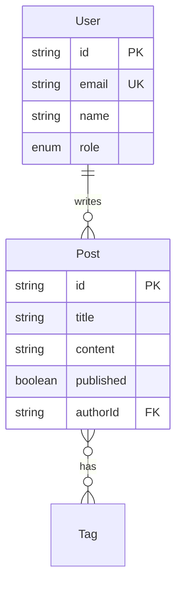

# DB Schema Designer - Database Schema Design

## Overview

Transforms domain descriptions into optimized database schemas with migrations, indexes, and relationship diagrams.

---

## 1. When to Apply

| Trigger | Behavior |
|---------|----------|
| New project data modeling | Full schema design workflow |
| "database schema", "ERD" | Interactive schema builder |
| Adding new entity/table | Incremental schema update |

---

## 2. Design Workflow

### Step 1: Domain Analysis
From user description, extract:
- **Entities**: Nouns → tables/collections
- **Relationships**: Verbs → foreign keys/references
- **Attributes**: Properties → columns/fields
- **Cardinality**: one-to-one, one-to-many, many-to-many

### Step 2: Schema Generation

**Prisma Example:**
```prisma
model User {
  id        String   @id @default(cuid())
  email     String   @unique
  name      String?
  role      Role     @default(USER)
  posts     Post[]
  createdAt DateTime @default(now())
  updatedAt DateTime @updatedAt

  @@index([email])
}

model Post {
  id        String   @id @default(cuid())
  title     String
  content   String?
  published Boolean  @default(false)
  author    User     @relation(fields: [authorId], references: [id])
  authorId  String
  tags      Tag[]
  createdAt DateTime @default(now())

  @@index([authorId])
  @@index([published, createdAt])
}
```

### Step 3: Index Strategy
```markdown
## Index Recommendations

| Table | Index | Type | Reason |
|-------|-------|------|--------|
| users | email | UNIQUE | Login lookup |
| posts | authorId | B-TREE | Filter by author |
| posts | (published, createdAt) | COMPOSITE | Published feed query |
| posts | title | GIN (trigram) | Full-text search |
```

### Step 4: Migration Script
Generate migration for chosen ORM/tool.

### Step 5: ERD (Mermaid)


---

## 3. Design Principles

1. **Start normalized, denormalize when needed** — 3NF first, optimize later
2. **Always add timestamps** — createdAt, updatedAt on every table
3. **Use UUIDs/CUIDs for IDs** — avoids enumeration attacks
4. **Soft delete when data matters** — deletedAt instead of DELETE
5. **Index foreign keys** — always index FK columns
6. **Plan for multi-tenancy early** — add tenantId if SaaS

---

## 4. Tool Coordination

| Tool | Purpose |
|------|---------|
| **Write** | Generate schema files, migrations |
| **Read** | Analyze existing schema |
| **Bash** | Run migrations (`npx prisma migrate`, `alembic upgrade`) |

---

## 5. Boundaries

**Will:**
- Design schemas from domain descriptions
- Generate Prisma/Drizzle/SQLAlchemy models
- Create migration scripts
- Recommend index strategies
- Generate ERD diagrams (Mermaid)

**Will Not:**
- Set up database servers
- Perform data migration between databases
- Optimize queries (use performance-profiler)
- Design caching strategies
